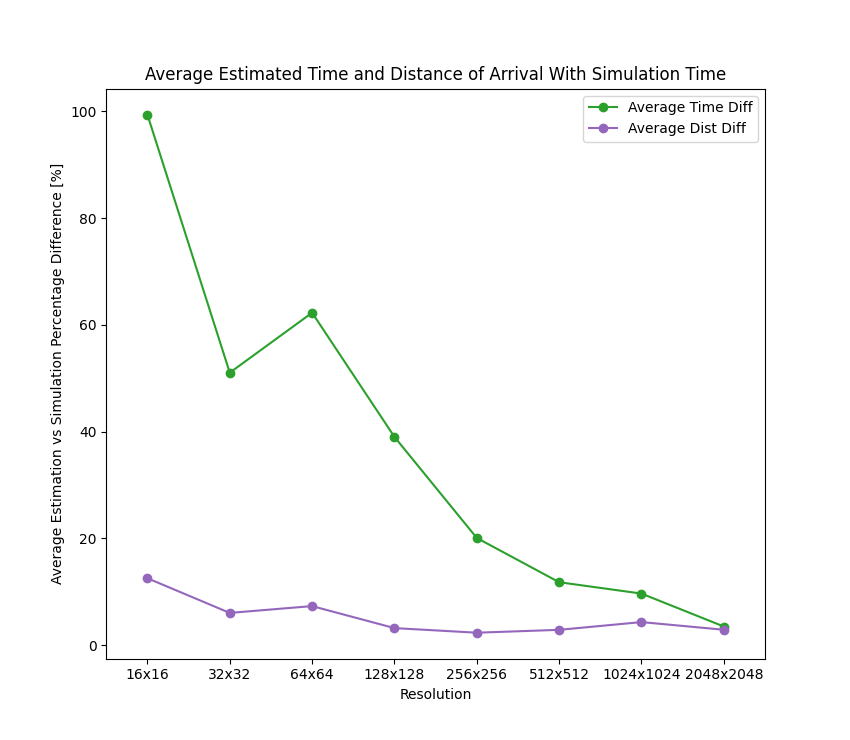
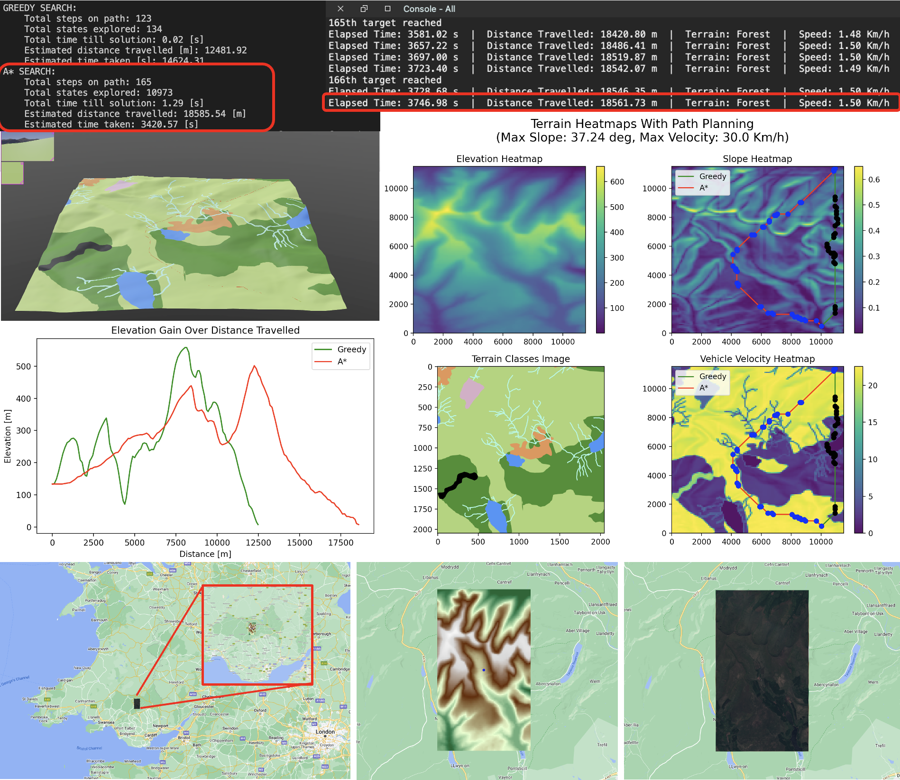
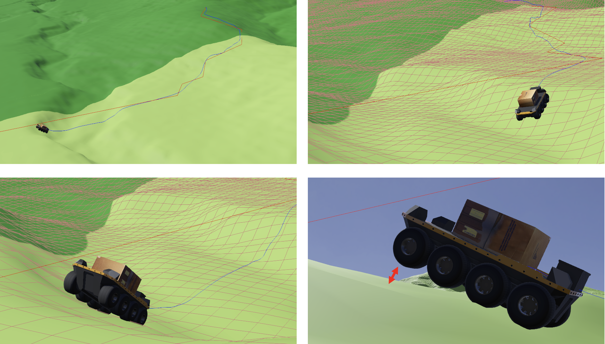
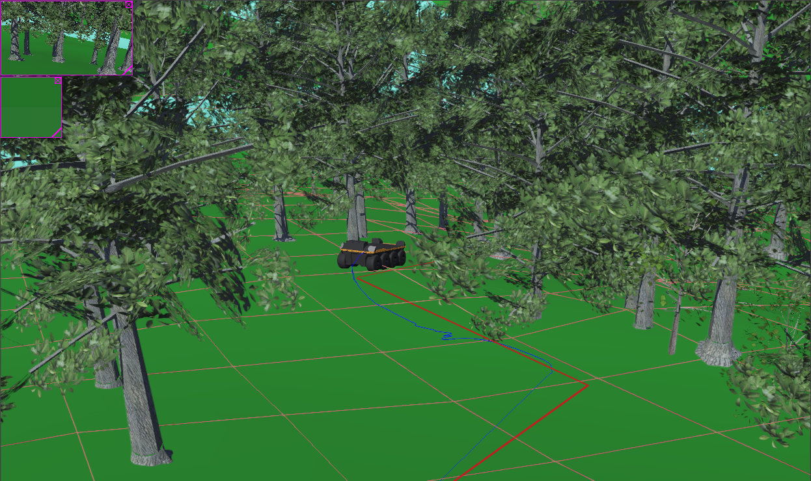
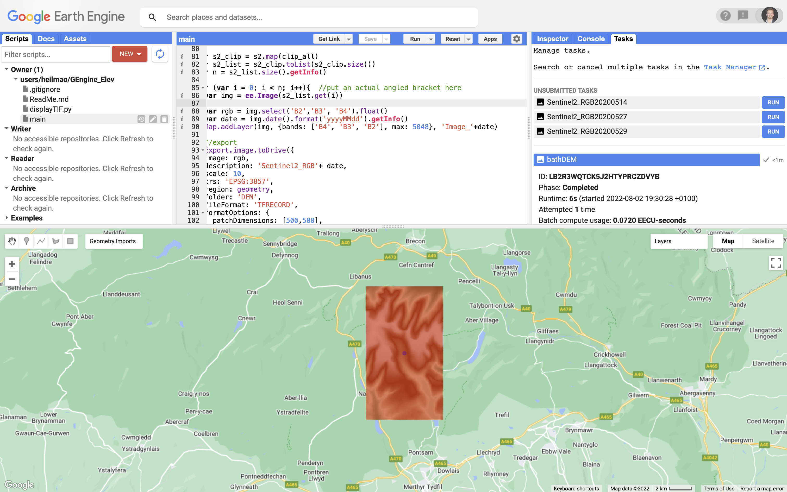

# Description
This repository contains the entire implementation of the __'Off-road Route Planning for Unmanned Ground Vehicles Using Passability Maps and Physics Simulation'__ project. Passability maps, which represent the degree to which a vehicle may pass through a given section of terrain, are generated using the 'Vegetation Roughness Factor (VRF) Method' described [here](https://www.mdpi.com/1424-8220/21/14/4682). Following this, the Greedy, Dijkstra's and A* grid-based path planning algorithms are used to calculate the shortest time taken to travel between two points.

Using the [Webots physics simulator](https://cyberbotics.com/#cyberbotics), the [Moose](https://levelfivesupplies.com/product/clearpath-moose-large-amphibious-ugv/#:~:text=Clearpath%20Moose%20UGV,-Contact%20us%20for&text=An%20all%2Dterrain%20robotic%20development,thick%20muds%2C%20and%20steep%20grades.) vehicle then drives the pre-calculated route across a 3D rendered model of the terrain used during route planning. Finally, _estimated_ results of 'Time Taken (to reach goal)' and 'Distance Taken' are compared with the corresponding _simulator_ values.

[Google Earth Engine](https://earthengine.google.com/) is used for accessing terrain data, the code for which is written in Javascript (see [this](GEngine_Elev) git submodule). All C coding elements are found [here](webots_moose) – these should be [compiled](https://cyberbotics.com/doc/guide/webots-built-in-editor) in the Webots simulator coding IDE. The rest of the project is written in Python.

# Highlights
An example showing a mountainous region in [Colorado](https://www.google.co.uk/maps/place/39%C2%B029'29.4%22N+108%C2%B005'49.1%22W/@39.4907692,-108.1010785,1452m/data=!3m1!1e3!4m5!3m4!1s0x0:0x2ff7560718e8f017!8m2!3d39.491504!4d-108.096965). Using Google Earth Engine, satellite and elevation data is accessed and processed. Passability maps are created and then route planning is conducted.

Averaged across multiple tests, the average testing results are presented below. The 'Time _Difference_' between estimated and simulation are represented in green. This represents how accurately the 'Modified VRF Method' predicted the time taken to complete a journey (as measured by the simulator). A similar thing for 'Distance Difference'.

# Other Images

# Python Versions for WeBots
WeBots Python doesn't currently support Arm86 architectures. Despite setting Python paths to the correct location, an Intel version (which runs on Rosetta) is required to be installed. Follow the below steps to resolve any errors encountered during setup:
1) Follow this: [Link to GitHub Issue](https://github.com/cyberbotics/webots/issues/4112#issuecomment-1012324873)
2) Applications --> Python 3.9 --> Python Interpreter --> Copy Path
3) WeBots --> Preferences --> Paste Path

# Cloning the Repo
Be sure to use the `git submodule update --init` command in the terminal after `git clone` in order to update the [Google Earth Engine](GEngine_Elev) submodule contents.

# Importing Custom Models/ Shapes/ Terrains:
1) Export a terrain model and make relevant changes to the dimensions
2) In WeBots: `(+)` --> Import --> FILE.wbo
3) Transform to chosen location
4) Make model solid by: Add Solid--> Children--> Shape--> Geometry--> Elevation Grid-->Name It-->Bounding Box Object--> Select Shape Geometry Name/ Mesh

# Useful Links:
1) [Cyberbotics Elevation Grid Documentation](https://www.cyberbotics.com/doc/reference/elevationgrid)
2) [Geodose Heatmap From Scratch](https://www.geodose.com/2018/01/creating-heatmap-in-python-from-scratch.html)
3) [Improved A-Star Algorithm for Long-Distance Off-Road Path Planning Using Terrain Data Map](https://www.mdpi.com/2220-9964/10/11/785)
4) [QGIS, Object Detection, Segmentation, Python Youtube Tutorial Series](https://www.youtube.com/watch?v=hgmhERX4YBw&list=PLzHdTn7Pdxs6R6gf-0aLCqy8pL1GazPEe)
5) [Github Python Issues](https://github.com/RoboCupJuniorTC/rcj-soccersim/issues/36)
6) [WeBots Appearance Files](https://github.com/cyberbotics/webots/tree/released/projects/appearances/protos)
7) [Git Subdirectories](https://git-scm.com/book/en/v2/Git-Tools-Submodules)
8) [Google Earth Engine DEM Catalogue](https://developers.google.com/earth-engine/datasets/catalog)
9) [YOUTUBE: How to download Satellite Images from the USGS, ESA and Google Earth Engine](https://www.youtube.com/watch?v=uQvlTQoUWuQ)
10) [YOUTUBE: Google Earth Engine Tutorial for Beginners: Map Elevation Data](https://www.youtube.com/watch?v=KQcSzClomtg)
11) [YOUTUBE: Google Earth Engine Tutorial: DEM (Slope & Color Gradient)](https://www.youtube.com/watch?v=ulPoIlt77QI)
12) [QGIS Download](https://www.qgis.org/en/site/)

# Notes
1) Make sure that the correct paths to elevationmap_vehicle_config.txt are in moose_path_following_mod and supervisor_draw_trail_mod!
2) If you get errors in any C scripts it might be to do with reaching the maximum memory allocation for waypoints. Change MAXIMUM_NUMBER_OF_COORDINATES to a larger number and recompile this (inside of WeBots editor using the gear icon) to fix the issue.
3) CustomAppearance.proto has a file path defined (pointing toward an image in texture folder, make sure it is correct!)
4) image_map function in Terrain class specifies a file path to the CustomAppearance.png file. Make sure it is the same place as above.