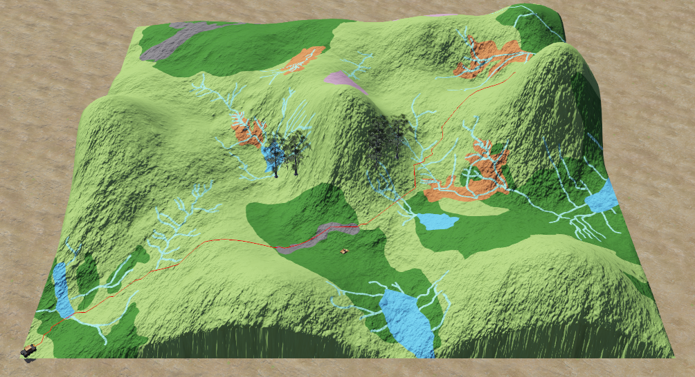
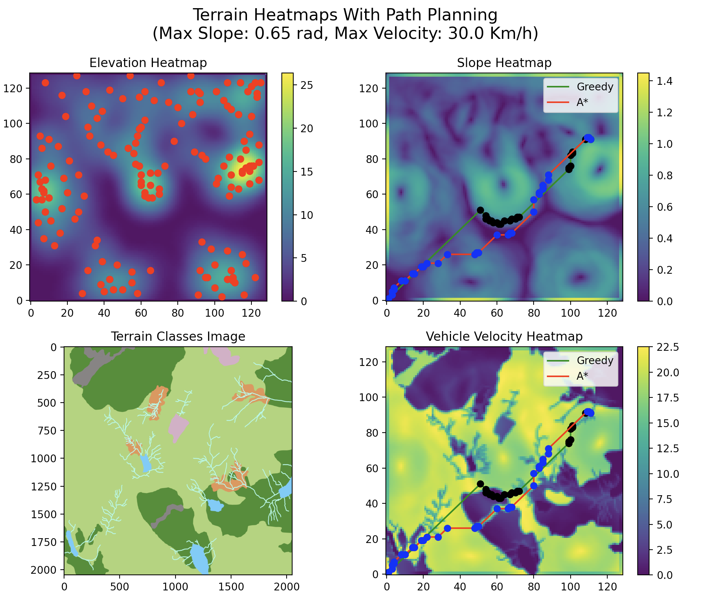

# Description
Code designed to ...

# Images

# Python Versions for WeBots
WeBots Python doesn't currently support Arm86 architectures. Despite setting Python paths to the correct location, an Intel version (which runs on Rosetta) is required to be installed. Do the following to resolve any errors encountered during setup:
1) Follow this: [Link to GitHub Issue](https://github.com/cyberbotics/webots/issues/4112#issuecomment-1012324873)
2) Applications --> Python 3.9 --> Python Interpreter --> Copy Path
3) WeBots --> Preferences --> Paste Path

# Importing Custom Models/ Shapes/ Terrains:
1) Export a terrain model and make relevant changes to the dimensions
2) In WeBots: `(+)` --> Import --> FILE.wbo
3) Transform to chosen location
4) Make model solid by: Add Solid--> Children--> Shape--> Geometry--> Elevation Grid-->Name It-->Bounding Box Object--> Select Shape Geometry Name/ Mesh

# Useful Links:
1) [Cyberbotics Elevation Grid Documentation](https://www.cyberbotics.com/doc/reference/elevationgrid)
2) [Geodose Heatmap From Scratch](https://www.geodose.com/2018/01/creating-heatmap-in-python-from-scratch.html)
3) [Improved A-Star Algorithm for Long-Distance Off-Road Path Planning Using Terrain Data Map](https://www.mdpi.com/2220-9964/10/11/785)
4) [QGIS, Object Detection, Segmentation, Python Youtube Tutorial Series](https://www.youtube.com/watch?v=hgmhERX4YBw&list=PLzHdTn7Pdxs6R6gf-0aLCqy8pL1GazPEe)
5) [Github Python Issues](https://github.com/RoboCupJuniorTC/rcj-soccersim/issues/36)
6) [WeBots Appearance Files](https://github.com/cyberbotics/webots/tree/released/projects/appearances/protos)

# Notes
1) Make sure that the correct paths to elevationmap_vehicle_config.txt are in moose_path_following_mod and supervisor_draw_trail_mod!
2) If you get errors in any C scripts it might be to do with reaching the maximum memory allocation for waypoints. Change MAXIMUM_NUMBER_OF_COORDINATES to a larger number and recompile this (inside of WeBots editor using the gear icon) to fix the issue.
3) CustomAppearance.proto has a file path defined (pointing toward an image in texture folder, make sure it is correct!)
4) image_map function in Terrain class specifies a file path to the CustomAppearance.png file. Make sure it is the same place as above.