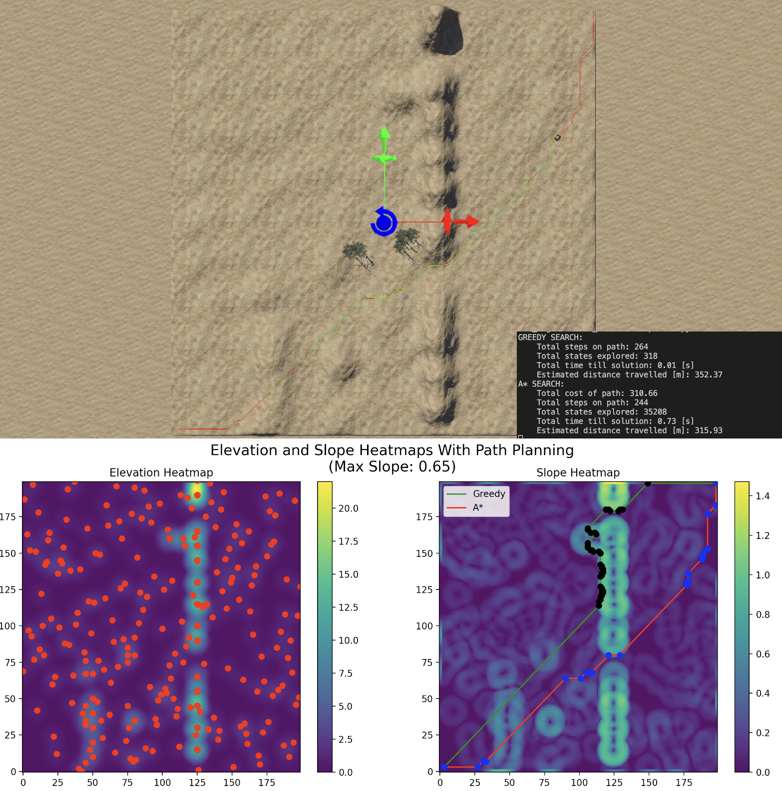
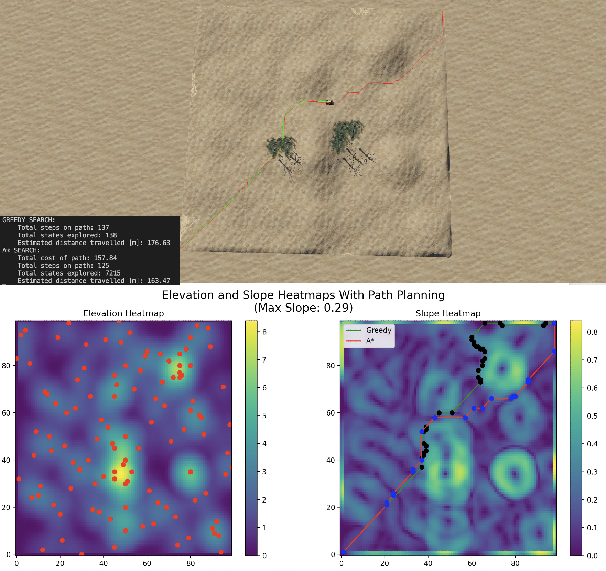

# Description
Code designed to ...

# Images

# Notes
1) Make sure that the correct paths to elevationmap_vehicle_config.txt are in moose_path_following_mod and supervisor_draw_trail_mod!
2) If you get errors in any C scripts it might be to do with reaching the maximum memory allocation for waypoints. Change MAXIMUM_NUMBER_OF_COORDINATES to a larger number and recompile this (inside of WeBots editor using the gear icon) to fix the issue.

# Useful Links:
1) [Cyberbotics Elevation Grid Documentation](https://www.cyberbotics.com/doc/reference/elevationgrid)
2) [Geodose Heatmap From Scratch](https://www.geodose.com/2018/01/creating-heatmap-in-python-from-scratch.html)
3) [Improved A-Star Algorithm for Long-Distance Off-Road Path Planning Using Terrain Data Map](https://www.mdpi.com/2220-9964/10/11/785)